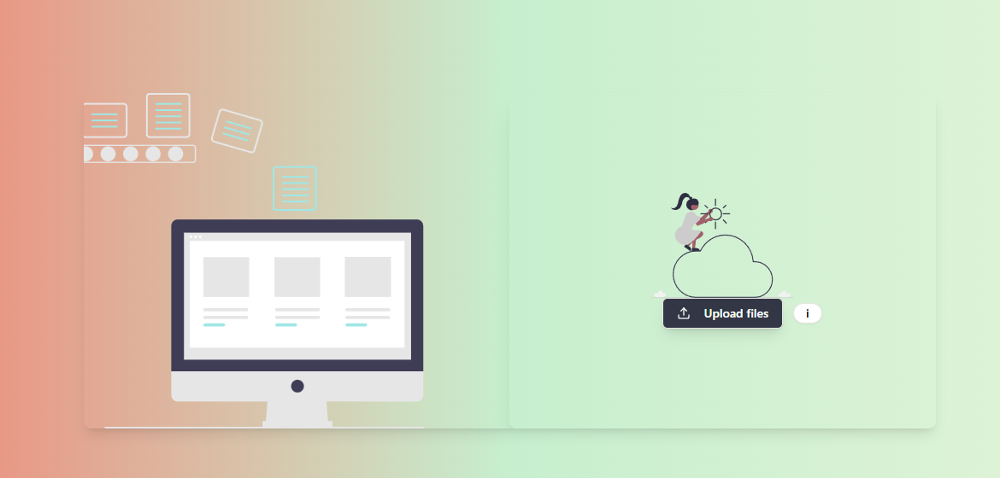
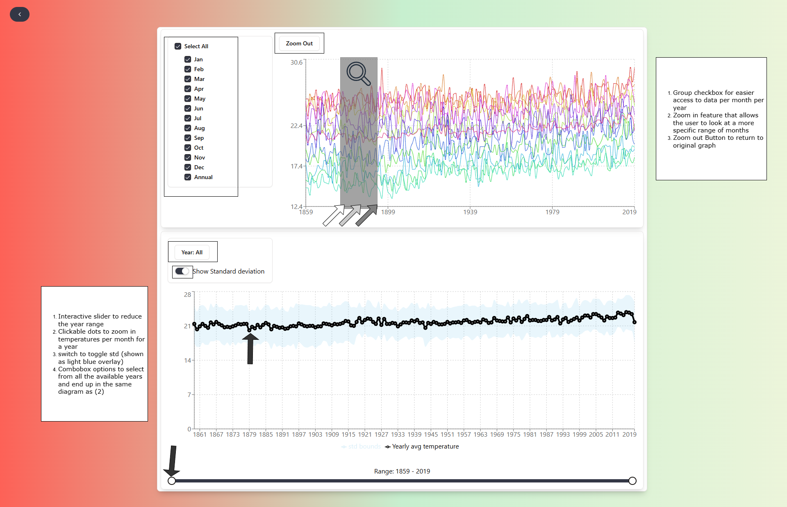

# Climate Data Visualization App

An interactive web application for uploading, processing, and visualizing climate data trends. This project features both a robust backend powered by FastAPI and an intuitive frontend built using React and Tailwind CSS.

---

## Table of Contents

1. [Introduction](#introduction)
2. [Features](#features)
3. [Technology Stack](#technology-stack)
4. [Setup and Installation](#setup-and-installation)
5. [Usage](#usage)
6. [Project Structure](#project-structure)
7. [Screenshots](#screenshots)

---

## Introduction

This app was designed to visualize temperature trends over time. Users can upload CSV files with climate data (e.g., temperatures by month and year), which are processed to display insightful visualizations, including yearly averages and ±1σ (standard deviation) overlays.

---

## Features

1. **File Upload**:
   - Accepts `.csv` files with climate data.
   - Validates and processes data to compute yearly and monthly trends.
2. **Interactive Graphs**:
   - View data grouped by months or yearly averages.
   - Overlay ±1σ around mean values.
   - Zoom into specific years for detailed analysis.
3. **Error Handling**:
   - Displays user-friendly error messages for incorrect file formats or missing data.
4. **Customizable Visualizations**:
   - Interactive controls for tailoring the graph display.
5. **Modern UI/UX**:
   - Built with Tailwind CSS and Radix UI for a seamless experience.
6. **Responsive Design**:
   - Works on all devices, including mobile and desktop.
7. 

---

## Technology Stack

### Backend:

- **Framework**: FastAPI
- **Key Libraries**: Pandas, NumPy
- **Routing**: FastAPI Routers (upload and dataFormatting)

### Frontend:

- **Framework**: React
- **Styling**: Tailwind CSS
- **Graphing**: Recharts
- **Development Tools**: Vite, shadcn/ui

---

## Setup and Installation

### Prerequisites:

1. **Backend**:
   - Python 3.9 or higher
   - Pip
2. **Frontend**:
   - Node.js 18 or higher
   - npm or yarn

### Backend Setup:

```bash
# Navigate to the backend folder
cd Backend

# Create a virtual environment
python -m venv venv
source venv/bin/activate  # On Windows: venv\Scripts\activate

# Install dependencies
pip install -r requirements.txt

# Start the server
uvicorn app.server:server --reload
```

### Frontend Setup:

```bash
# Navigate to the frontend folder
cd frontend/Tesla_temperature_visualization

# Install dependencies
npm install

# Start the development server
npm run dev
```

### Running the App:

1. Open the backend server at `http://localhost:8000`.
2. Open the frontend server at `http://localhost:3000`.

---

## Usage

1. Upload a CSV file with climate data.
2. View the processed data in the interactive graph.
3. Customize the graph display using the controls.
4. Analyze temperature trends over time.

## Project Structure

```
Backend
├── app
│   ├── controllers
│   │   ├── plotController.py
│   │   └── uploadController.py
│   ├── routers
│   │   ├── plotRouter.py
│   │   └── uploadRouter.py
|   ├── server.py
├── user_data
|   └── user_id
|       ├── (uploaded_csv).csv
|       └── temperature_data.json
└── requirements.txt

Frontend
├── Tesla_temperature_visualization
│   ├── public
│   │   └── img
│   │       └── ...
│   └── src
│       ├── components
│       │   ├── DataPerMonthGraph.jsx
│       │   ├── DataPerYearGraph.jsx
│       │   ├── GroupCheckbox.jsx
│       │   ├── UploadButton.jsx
│       │   ├──  UploadTooltip.jsx
│       │   └──  ui
│       ├── pages
│       │   ├── Home.jsx
│       │   ├── AccessDenied.jsx
│       │   └── Graph.jsx
│       ├── lib
│       │   └── utils.js
│       ├── App.css
│       ├── App.jsx
│       ├── index.css
|       └── main.jsx
├── package.json
└── configs
```

## Screenshots




# temperature-data-analysis

